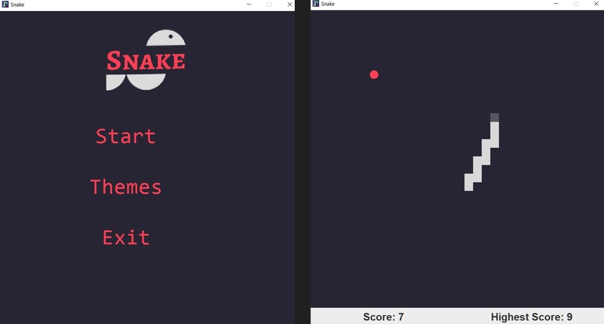

# 🐍 Java Snake Game

A classic **Snake Game** implemented in **Java** using `javax.swing` and `java.awt`. with three unique themes,
Control the snake, eat food, and grow longer while avoiding collisions!

---

## 🎮 How to Play
- Use the **arrow keys** (`↑`, `↓`, `←`, `→`) to move the snake.
- Eat food **(red circle)** to grow longer.
- Avoid colliding with the walls or yourself.
- Try to get the highest score! 🚀

---
## 🛠 Installation & Running
Easiest way to play is to download it from the release

**Compile and Build yourself**

Ensure you have **Java (JDK 8+)** installed.  
- Open a terminal in the game folder and run `javac *.java` to compile all the source code into .class file
- now run the command `java Main` to launch (sometimes it may not launch, in that case launch again)

You can also make your own .jar file and convert it into .exe 